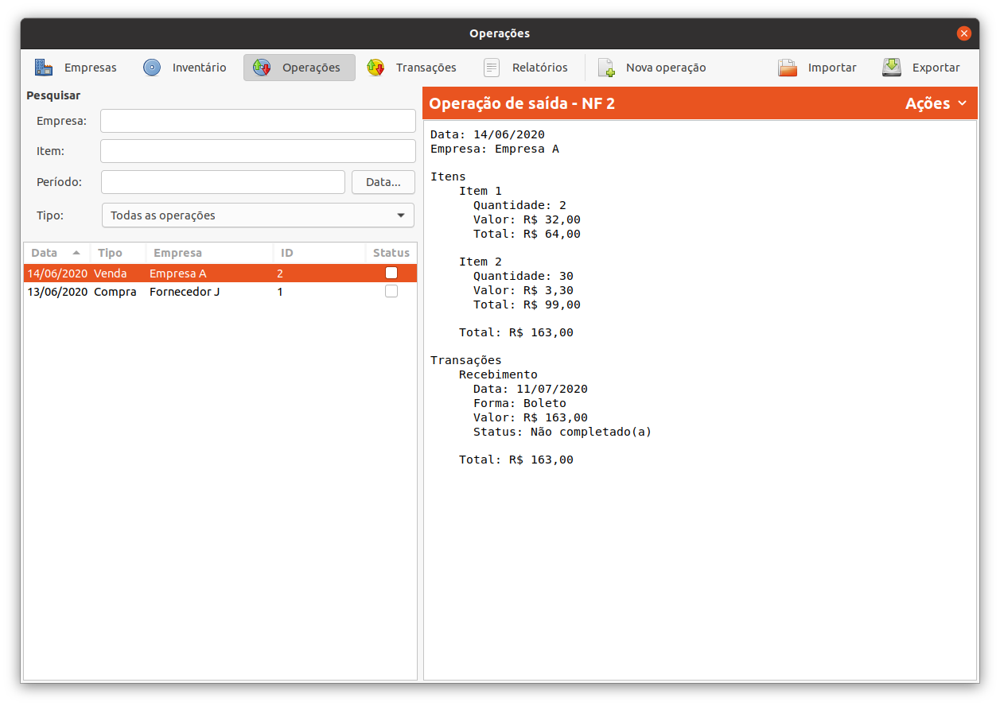

# Oks

Oks is a small ERP system tailor-made for a grinding wheel company in Brazil.
It has been in use for 14+ years without any hiccups at all.

It features:

- Customer/supplier management
- Inventory control
- Order, sales and manufacture management
- Accounts payable/receivable
- Several highly-customized reports

It was originally built using Python 2, PyGTK and SQLite, and has since been
updated to Python 3 and the new GTK/GI bindings.

It was mostly developed in 2008, when I (Allan) was 18 years old, before I
started college. I am proud of some parts of this project, namely the database
model, the abstractions I came up with and the overall tidiness of the code.
I'm a little ashamed by the lack of proper internationalization, poor testing
(there are only some integration tests). But this thing still works after all
this time and is still used everyday :)

## Running

On a vanilla Ubuntu 22.04 install, just `cd` into the root folder and run:

    $ python3 oks.py

The SQLite database will be created. The user interface only supports the
Portuguese language (despite all of the actual code being in English).

The company for which Oks was developed allows the code to be published here
under the Apache 2.0 license. The icons were made by Luiz Henrique Camargo.
